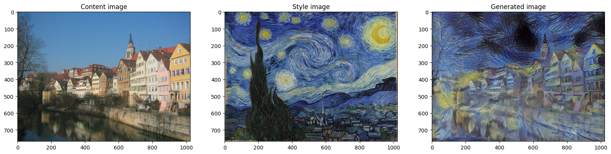

# Style Transfer
A PyTorch implementation of Neural Style Transfer[1].


# Quick Start
Download pretrained VGG19 model from the link below and place it in `data/`.
```
https://drive.google.com/file/d/1JNrSVZrK4TfC7pFG-r7AOmGvBXF2VFOt/view?usp=sharing
```
Run the notebook to get the results with default configuration.

# Configuration
You can also customize the configuration. For example,
```
content_losses_from = [
                        ("conv4_2", 1.0),
                      ]

style_losses_from = [
                        ("conv1_1", 0.2),
                        ("conv2_1", 0.2),
                        ("conv3_1", 0.2),
                        ("conv4_1", 0.2),
                        ("conv5_1", 0.2),
                    ]

losses, style_losses, content_losses = train(content_losses_from=content_losses_from, style_losses_from=style_losses_from,
                                             opt="adam", num_iter=5000, show_every=500, learning_rate=1e-0, pooling="avg",
                                             alpha=1, beta=1e4, tv_weight=0)
```

`content_losses_from`: Layers and their contributing weights for content loss.  
`style_losses_from`: Layers and their contributing weights for style loss.  
`opt`: Which optimizer to use. Support `adam` and `LBFGS`.  
`num_iter`: Number of iterations to update the image.  
`show_every`: Show progress for every `show_every` iterations.  
`alpha`: Weight for content loss.  
`beta`: Weight for style loss.  
`tv_weight`: Weight for total variation (L2) loss.  

# Results


# References
[1] Gatys, L. A., Ecker, A. S., & Bethge, M. (2016). Image style transfer using convolutional neural networks. In *Proceedings of the IEEE Conference on Computer Vision and Pattern Recognition* (pp. 2414-2423). Retrieved from [https://www.cv-foundation.org/openaccess/content_cvpr_2016/papers/Gatys_Image_Style_Transfer_CVPR_2016_paper.pdf](https://www.cv-foundation.org/openaccess/content_cvpr_2016/papers/Gatys_Image_Style_Transfer_CVPR_2016_paper.pdf)
